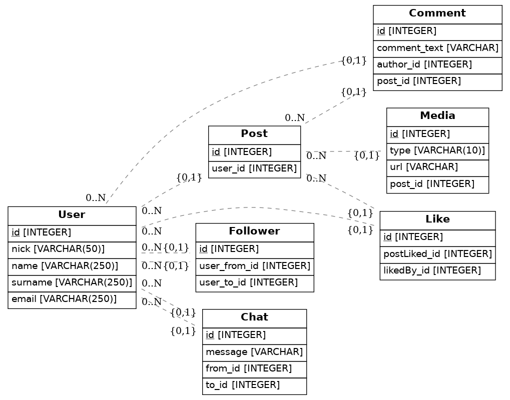

# Instagram model database with Python's SQLAlchemy 

## 💻 Installation

1. Get inside the environment `$ pipenv shell`

2. Install all dependencies `$ pipenv install`

3. Generate de diagram as many times as you need `$ python src/models.py`

4. Open the file `diagram.png` to check out your UML diagram!

## 📝Instructions received

Your Job is to update the `src/models.py` file with the code needed to replicate the instagram data model.

The project is using the SQLAlchemy Python library to generate the database.

- What tables do you think instagram might have on its database: E.g: Post, User, etc.?
- What properties should go inside the user? or inside the Post table?
- Please add at least 4 models with all of its properties.
- Degenerate the diagram.png file at the end by running `$ python3 models.py` on the console.

# My Code

For this exercise I setted up a lot of tables due of the complexity of the main Instagram App.

There's a show down of the code in `SQL tables`

>_That's all folks,_
>
>_thank you for reading!_
>
>_**AslanSN**_